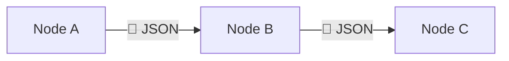

<!--

author: Volker G. Göhler

email:  volker.goehler@informatik.tu-freiberg.de

version: 0.0.1

language: de

narrator:Deutsch Male

edit: true
date: 2026
icon: img/TUBAF_Logo_EN_blau.png

logo: 
attribute: 

comment: Distributed Software

link: ./styles.css

title: Introduction to N8N Workflows

import:   https://raw.githubusercontent.com/liaScript/mermaid_template/master/README.md

tags: Lehre, TUBAF

-->

# Introduction to N8N Workflows

**Distributed Software, 2026**

Volker Göhler, TU Bergakademie Freiberg

------------------------------

")<!-- height=100%" -->

> "Code" auf https://github.com/vgoehler/introduction-to-n8n als Open Educational Ressource.

----------------------------------------

## Motivation: Warum Automatisierung?

- Wiederkehrende digitale Aufgaben sind allgegenwärtig
- APIs, Datenpipelines, Benachrichtigungen, Reports
- Manuelle Prozesse sind:
  - fehleranfällig
  - zeitaufwendig
  - schwer skalierbar

**Zentrale Frage:**  
> Müssen wir wirklich *alles* selbst programmieren?

---

## Automatisierung in der Praxis

Beispiele aus Hochschule und Industrie:
- Automatisches Sammeln von Umfrageergebnissen
- Synchronisation von Tools (GitHub, LMS, Cloud-Speicher)
- Monitoring von Services oder Experimenten
- Anbindung von KI-Diensten ohne eigenes Backend

---

## Wo ordnet sich n8n ein?

| Ansatz | Eigenschaften |
|------|---------------|
| Skripte | Flexibel, aber wartungsintensiv |
| Eigenes Backend | Mächtig, aber hoher Aufwand |
| No-/Low-Code-Tools | Schnell, visuell, zugänglich |
| **n8n** | Self-hosted, erweiterbar, entwicklernah |

---

## Was ist n8n?

- Open-Source-Tool zur **Workflow-Automatisierung**
- Visueller Editor für **Datenfluss-Pipelines**
- Node-basiertes Ausführungsmodell
- Cloud- oder Self-Hosting möglich

**Mentales Modell:**  
> n8n = ausführbares Flussdiagramm

---

## Zentrale Konzepte

- **Workflow**: Verbundene Nodes als Pipeline
- **Trigger-Nodes**: Starten den Workflow
  - Manuell
  - Webhook
  - Cron
- **Normale Nodes**: Verarbeiten oder leiten Daten weiter
- **Execution**: Ein einzelner Durchlauf eines Workflows

---

## Datenmodell

- Alle Daten werden als **JSON** weitergegeben
- Jeder Node:
  - erhält Eingabedaten
  - erzeugt Ausgabedaten

**Wichtig:**  
n8n wird *nicht* zeilenweise wie ein Skript ausgeführt.

---

## Die n8n-Oberfläche

Zentrale Elemente:
- Workflow-Canvas
- Node-Konfigurationsbereich
- Ausführungshistorie
- Ein- und Ausgabe-Inspektor

**Faustregel:**  
> Immer zuerst die Daten anschauen.

---

## Geführter Workflow: Überblick

Wir bauen gemeinsam einen einfachen Workflow:
1. Manueller Trigger
2. Strukturierte Daten setzen
3. Daten transformieren
4. Ausgabe inspizieren

Ziel:
- Verkettung von Nodes verstehen
- Datenfluss nachvollziehen

---

## Geführter Workflow: Schritt 1

**Manueller Trigger**
- Startet den Workflow manuell
- Keine Eingabedaten erforderlich

Warum?
- Ideal zum Testen
- Deterministisches Verhalten

---

## Geführter Workflow: Schritt 2

**Set-Node**
- Definiert strukturierte JSON-Daten

Beispiel-Felder:
- `name`
- `kurs`
- `zeitstempel`

Zweck:
- Vorhersehbare Eingaben erzeugen
- Datenstruktur kennenlernen

---

## Geführter Workflow: Schritt 3

**Function-Node**
- JavaScript-basierte Datenverarbeitung
- Zugriff auf Eingaben über `$json`

Beispiele:
- Texte verändern
- Berechnete Werte hinzufügen
- Ausgabe umstrukturieren

---

## Ausführung analysieren

- Workflow starten
- Nodes anklicken
- Prüfen:
  - Eingabedaten
  - Ausgabedaten
- Vorher-/Nachher-Vergleich

**Mini-Aufgabe:**  
Fügen Sie Ihren Namen und die aktuelle Uhrzeit zur Ausgabe hinzu.

---

## Hands-on-Übung

### Aufgabe: Webhook-basierter Workflow

Szenario:
- Empfang externer JSON-Daten
- Validierung des Inhalts
- Weiterleitung oder Ablehnung der Anfrage

---

## Erforderliche Workflow-Logik

1. **Webhook-Trigger**
2. **IF-Node**
   - Bedingung auf JSON-Feld
3. **Akzeptierter Pfad**
   - Weiterleitung per HTTP
4. **Abgelehnter Pfad**
   - Rückgabe einer Fehlermeldung

---

## Lernziele der Übung

- Selbstständiges Arbeiten mit n8n
- Einsatz von bedingter Logik
- Debugging fehlerhafter Workflows
- Verständnis realer Automatisierungsmuster

---

## Typische Probleme (und warum sie auftreten)

- Falscher JSON-Pfad
- Nodes nicht verbunden
- Fehler in Expressions
- Annahmen über Datenstruktur

**Gute Nachricht:**  
Diese Fehler sind in n8n *sichtbar*.

---

## Debugging in n8n

Werkzeuge:
- Wiederholung von Executions
- Vergleich von Ein- und Ausgabe
- Pinned Data
- Inkrementelles Testen

**Debugging-Mindset:**  
> Den Daten folgen, nicht den Nodes.

---

## Fortgeschrittene Demo: APIs & KI

Beispiele:
- API-basierte Datenanreicherung
- Textklassifikation
- Zusammenfassungen
- Bedingtes Routing basierend auf KI-Ausgaben

Fokus:
- Konzept, nicht vollständige Implementierung

---

## Kritische Perspektive

Automatisierung ist nicht immer die beste Lösung:
- Versteckte Komplexität
- Wartungsaufwand
- Datenschutz & Privatsphäre
- Reproduzierbarkeit
- Risiko der Überautomatisierung

**Diskussionsfrage:**  
Wo sollten Menschen „im Loop“ bleiben?

---

## Reflexion

Diskussion:
- Wo würde n8n Ihnen *jetzt* helfen?
- Wo wäre es problematisch?
- Wie verändert Low-Code Softwareentwicklung?

---

## Ausblick

Mögliche nächste Themen:
- Versionskontrolle für Workflows
- Deployment & Skalierung
- Secrets & Credentials
- Automatisierung als Backend-Ersatz
- Mensch–KI-Kollaboration

---

## Optionale Aufgabe

- Identifizieren Sie eine reale Aufgabe zur Automatisierung
- Implementieren Sie einen funktionierenden n8n-Workflow
- Dokumentieren Sie:
  - Ziel
  - Workflow-Logik
  - Reflexion zu Grenzen

---

## Zentrale Erkenntnisse

- n8n ermöglicht schnelle, transparente Automatisierung
- Datenflussdenken ist zentral
- Low-Code ≠ kein Denken
- Automatisierung ist immer eine Designentscheidung

**Vielen Dank!**
