<!--

author: Volker G. Göhler

email:  volker.goehler@informatik.tu-freiberg.de

version: 0.0.3

language: de

narrator: Deutsch Male

edit: true
date: 2026
icon: img/TUBAF_Logo_EN_blau.png

logo: 
attribute: 

comment: Distributed Software

import: https://raw.githubusercontent.com/liaScript/mermaid_template/master/README.md

link: https://raw.githubusercontent.com/vgoehler/introduction-to-n8n/refs/heads/main/styles.css

title: Introduction to N8N Workflows 01

tags: Lehre, TUBAF

-->
[](https://liascript.github.io/course/?https://raw.githubusercontent.com/vgoehler/introduction-to-n8n/refs/heads/main/lesson_01.md)

# Introduction to N8N Workflows

**Distributed Software, 2026**

Volker Göhler, TU Bergakademie Freiberg

------------------------------

")<!-- style="width:500px;" -->

> "Code" auf https://github.com/vgoehler/introduction-to-n8n als Open Educational Ressource.

----------------------------------------

## Motivation: Warum Automatisierung?

<section class="flex-container border">
<div class="flex-child">

- Wiederkehrende digitale Aufgaben sind allgegenwärtig
- APIs, Datenpipelines, Benachrichtigungen, Reports
- Manuelle Prozesse sind:

  - fehleranfällig
  - zeitaufwendig
  - schwer skalierbar


</div>
<div class="flex-child" style="margin-top:10px;">

<!-- style="width:400px;" -->

</div>
</section>

### Fragen?

> **Zentrale Fragen:**  
>
> - Was können wir automatisieren, und wie?
> - Müssen wir wirklich *alles* selbst programmieren?

### Automatisierung in der Praxis

Beispiele aus Hochschule und Industrie:

- Automatisches Sammeln von Umfrageergebnissen
- Synchronisation von Tools (GitHub, LMS, Cloud-Speicher)
- Monitoring von Services oder Experimenten
- Anbindung von KI-Diensten ohne eigenes Backend

---

        {{1}}

**Welche groben Kategorien von Automatisierungsebenen gibt es?**

        {{2}}
**Füllen Sie das Radar Diagram aus!**

### Wo ordnet sich n8n ein?

<!-- style="width:600px;" -->

## Was ist n8n?

- Open-Source-Tool zur **Workflow-Automatisierung**
- Visueller Editor für **Datenfluss-Pipelines**
- Node-basiertes Ausführungsmodell
- Cloud- oder Self-Hosting möglich
- [n8n.io](n8n.io)

> **Mentales Modell:**  
>
> n8n $=$ ausführbares Flussdiagramm


### Zentrale Konzepte

- **Workflow**: Verbundene Nodes als Pipeline
- **Trigger-Nodes**: Starten den Workflow
  - Manuell
  - Webhook
  - Cron
- **Normale Nodes**: Verarbeiten oder leiten Daten weiter
- **Execution**: Ein einzelner Durchlauf eines Workflows

Datenmodell
-------------------

- Alle Daten werden als **JSON** weitergegeben
- Jeder Node:

  - erhält Eingabedaten
  - erzeugt Ausgabedaten

```mermaid @mermaid
graph LR
    NodeA["Node A"] -->|📄 JSON| NodeB["Node B"]
    NodeB -->|📄 JSON| NodeC["Node C"]
```



**Wichtig:**  
n8n wird *nicht* zeilenweise wie ein Skript ausgeführt.

### n8n Installation

Cloud und Self-hosting

** Install [npm](https://docs.n8n.io/hosting/installation/npm/)**

```shell bash
    npm install n8n -g
    n8n start 

    oder

    n8n
```

**Install [docker](https://docs.n8n.io/hosting/installation/docker/)**

- download docker compose file
- ins Verzeichnis wechseln
- `docker compose up -d`
    
<!-- DOCKER_COMPOSE_YAML_START -->

```yaml docker_compose.yaml
services:
  n8n:
    image: docker.n8n.io/n8nio/n8n
    container_name: n8n
    ports:
      - "5678:5678"
    volumes:
      - n8n_data:/home/node/.n8n
    environment:
      - N8N_RUNNERS_ENABLED=true
    restart: unless-stopped

volumes:
  n8n_data:
```

<!-- DOCKER_COMPOSE_YAML_END -->

### Die n8n-Oberfläche

`localhost:5678` im Browser öffnen

Zentrale Elemente:

- Workflow-Canvas
- Node-Konfigurationsbereich
- Ausführungshistorie
- Ein- und Ausgabe-Inspektor

**Faustregel:**  
> Immer zuerst die Daten anschauen.

<!-- style="width:600px;" -->

## Geführter Workflow

### Überblick

Wir bauen gemeinsam einen einfachen Workflow:

1. Manueller Trigger
2. Strukturierte Daten setzen
3. Daten transformieren
4. Ausgabe inspizieren

*Ziel*:

- Verkettung von Nodes verstehen
- Datenfluss nachvollziehen

### Nodes

> **Manueller Trigger**
> 
> - Startet den Workflow manuell
> - Keine Eingabedaten erforderlich

Warum?

- Ideal zum Testen
- Deterministisches Verhalten

---

> **EditFields / Set-Node**
>
> - Definiert strukturierte JSON-Daten

Beispiel-Felder:

- `name`
- `kurs`
- `zeitstempel`

Zweck:

- Vorhersehbare Eingaben erzeugen
- Datenstruktur kennenlernen

---

> **Code-Node**
> 
> - JavaScript-basierte Datenverarbeitung
> - Zugriff auf Eingaben über `$json`

Beispiele:

- Texte verändern
- Berechnete Werte hinzufügen
- Ausgabe umstrukturieren

### Arbeitsschritte

**Schritte:**

- Workflow starten
- Nodes anklicken
- Prüfen:

  - Eingabedaten
  - Ausgabedaten

- Vorher-/Nachher-Vergleich

**Mini-Aufgabe:**  

- Fügen Sie Ihren **Namen** und die **aktuelle Uhrzeit** zur Ausgabe hinzu.
- binden Sie Forms ein und nutzen Sie diese zur Eingabe von Name und Kurs.

## Debugging in n8n

<section class="flex-container border">
<div class="flex-child">

Werkzeuge:

- Wiederholung von Executions
- Vergleich von Ein- und Ausgabe
- Pinned Data
- Inkrementelles Testen

**Debugging-Mindset:**  
> Den Daten folgen, nicht den Nodes.

</div>
<div class="flex-child" style="margin-top:10px;">

<!-- style="width:400px;" -->

</div>
</section>

---

https://deckofcardsapi.com/api/deck/new/draw/?count=5

## Hands-on-Übung

**Aufgabe: Webhook-basierter Workflow**

Szenario:

- Zwei Workflows
- Aktivierung des Webhooks in einem Workflow
- Anderer Workflow holt Daten ab, verarbeitet sie und sendet Antwort


### Erforderliche Workflow-Logik

1. **Webhook-Trigger**
2. **IF-Node**
   - Bedingung auf JSON-Feld
3. **Akzeptierter Pfad**
   - Weiterleitung per HTTP
4. **Abgelehnter Pfad**
   - Rückgabe einer Fehlermeldung

### Lernziele der Übung

- Selbstständiges Arbeiten mit n8n
- Einsatz von bedingter Logik
- Debugging fehlerhafter Workflows
- Verständnis realer Automatisierungsmuster

### Typische Probleme (und warum sie auftreten)

- Falscher JSON-Pfad
- Nodes nicht verbunden
- Fehler in Expressions
- Annahmen über Datenstruktur

**Gute Nachricht:**  
Diese Fehler sind in n8n *sichtbar*.

**Tipp:**

- HTTP-Request-Node verwenden
- Split-Out und Filter verwenden
- Use `Always Return Data` on Settings Page !

### Szenario

- Dem Webhook-Workflow wird eine JSON-Nutzlast gesendet.
- Diese enthält eine Kartenfarbe (DIAMONDS, HEARTS, SPADES, CLUBS) und eine Anzahl an Spielkarten. Beispielsweise:

```json
{
  "color": "HEARTS",
  "count": 5
}
```

- Der Workflow holt sich eine entsprechende **Anzahl** an Spielkarten von der Karten-API und sendet die URLs der Bilder der Karten in png zurück, wenn die **Farbe** stimmt.
- `https://deckofcardsapi.com/api/deck/new/draw/?count=5`
- Andernfalls wird eine Fehlermeldung zurückgegeben.

## Zusammenfassung

- n8n ist ein mächtiges Tool zur Automatisierung
- Visuelle Workflows erleichtern das Verständnis
- Debugging ist datengetrieben

<!-- style="font-size:huge;" -->
> Vielen Dank für Ihre Aufmerksamkeit!
>
> <!-- style="width:400px;" -->


