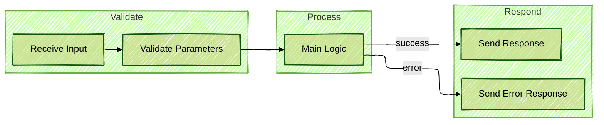

<!--

author: Volker G. Göhler

email:  volker.goehler@informatik.tu-freiberg.de

version: 0.0.1

language: de

narrator: Deutsch Male

edit: true
date: 2026
icon: img/TUBAF_Logo_EN_blau.png

logo: 
attribute: 

comment: Distributed Software

import: https://raw.githubusercontent.com/liaScript/mermaid_template/master/README.md

link: https://raw.githubusercontent.com/vgoehler/introduction-to-n8n/refs/heads/main/styles.css

title: Introduction to N8N Workflows 02

tags: Lehre, TUBAF

-->
[](https://liascript.github.io/course/?https://raw.githubusercontent.com/vgoehler/introduction-to-n8n/refs/heads/main/lesson_02.md)

# Einführung in n8n Workflows: Webhooks und APIs

Volker Göhler, TU Bergakademie Freiberg

------------------------------

")<!-- style="width:500px;" -->

> "Code" auf https://github.com/vgoehler/introduction-to-n8n als Open Educational Ressource.

----------------------------------------

## Rückblick

** Was haben wir das letzte mal gelernt? **

     {{1}}
> - Workflow basiertere Automatisierung
> - Knoten und Verbindungen
> - Trigger und Aktionen
> - Datenfluss und Kontexte
> - Einfache Beispiele

----------------------------------------

    {{2}}
> - Fortsetzen der WebHook Aufgabe

## Hands-on Aufgabe: WebHook Workflow

- Dem Webhook-Workflow wird eine JSON-Nutzlast gesendet.
- Diese enthält eine Kartenfarbe (DIAMONDS, HEARTS, SPADES, CLUBS) und eine Anzahl an Spielkarten. Beispielsweise:

```json
{
  "color": "HEARTS",
  "count": 5
}
```

- Der Workflow holt sich eine entsprechende **Anzahl** an Spielkarten von der Karten-API und sendet die URLs der Bilder der Karten in png zurück, wenn die **Farbe** stimmt.
- `https://deckofcardsapi.com/api/deck/new/draw/?count=5`
- Andernfalls wird eine Fehlermeldung zurückgegeben.

### Fragen?

- Wie waren Ihre Erfahrungen mit dem Wehbook Trigger?
- Wie hat der Datenstrom sich verhalten?
- Gab es Herausforderungen bei der Konfiguration der Nodes?

## Fehler in n8n: Grundsätzliches Verhalten

n8n unterscheidet **nicht automatisch** zwischen:

- fachlichen Fehlern (z. B. „keine Daten gefunden“)
- technischen Fehlern (z. B. Node schlägt fehl)

➡️ **Beides führt zunächst zu einem fehlgeschlagenen Workflow**,  
wenn nichts explizit abgefangen wird.

---

**Was passiert, wenn ein Node fehlschlägt?**

Typische Ursachen:

- ungültiger JSON-Pfad
- fehlende Variable
- API-Fehler (4xx / 5xx)
- leere Datenmenge

Standardverhalten:

- Workflow **stoppt**
- nachfolgende Nodes werden **nicht ausgeführt**
- kein Webhook-Response → aufrufender Client hängt

---

### „Continue On Fail“ – wichtiges Werkzeug

Viele Nodes bieten:

- **Continue On Fail**

**Effekt:**

- Workflow läuft weiter
- Fehler wird als **Datenobjekt** weitergegeben

**Alternativ**: auch als eigener error Pfad

➡️ Voraussetzung für:

- kontrollierte Fehlerbehandlung
- eigene Fehlermeldungen
- robuste Webhook-Workflows

---

**Fehler sind Daten**

> **Best Practice:**
> 
> Fehler nicht „werfen“, sondern **modellieren**

**Beispiel:**

- IF-Node prüft Ergebnis
- expliziter Error-Pfad
- strukturierte Rückgabe über Webhook

**Ziel:**

- Workflow bleibt kontrollierbar
- Aufrufer kann reagieren

---

## GET-Parameter in Webhooks

Webhook-URLs können Parameter enthalten:

```
http://localhost:5678/webhook-test/37aac4b4-57aa-4ad1-82eb-292e8dfabe79?color=SPADES&count=3
```


In n8n verfügbar unter:

```
$json.query.color
$json.query.count
```

➡️ Typische Nutzung:

- Filter
- Modi (test / prod)
- Limits
- Flags

---

### Problem: Unsichere oder fehlende Parameter

Mögliche Probleme:

- Parameter fehlt
- falscher Typ
- unerwarteter Wert
- leere Strings

➡️ **Nie direkt verwenden**, ohne Prüfung!

---

## Safeguarding von Parametern

**Empfohlener Ablauf:**

1. Webhook-Node (Parameter empfangen)
2. **Set-Node** (Interface sichtbar machen, Typisierung)
3. **IF-Node** (Validierung)
4. Verarbeitung oder Fehlerpfad

**Alternativ:**

- **Filter  Node** für einfache Prüfungen
- **Function-Node** für komplexe Logik

Beispielprüfung:

- Existiert der Parameter?
- Hat er einen erlaubten Wert?
- Liegt er im erwarteten Bereich?

---

**Beispiel: Validierung mit IF-Node**

**Bedingungen:**

- `limit` existiert
- `limit > 0`
- `limit <= 100`

*Wenn nicht erfüllt:*

- Fehlerantwort
- Statuscode 400

> ➡️ Eingaben früh validieren, nicht erst später scheitern lassen.

---

## Rückgabemöglichkeiten aus Webhooks – Überblick

Ein Webhook-Workflow **muss immer antworten**.

Möglichkeiten:

- Erfolgsantwort (200)
- Fehlerantwort (4xx / 5xx)
- Leere Antwort (204)
- Strukturierte JSON-Daten

Realisierung:

- im Webhook selbst die Anwort setzen
- `When Last Node finishes` Option (keine Statuscodes!)
- **Respond to Webhook** Node verwenden

---

### Best Practice: Strukturierte JSON-Antworten

im JSON `status` und `data` Felder verwenden.


    {{1}}
<section>
**Erfolgsantwort**

Beispiel:

```json
{
  "status": "ok",
  "data": {
    "items": [...],
    "count": 5
  }
}
```

**Eigenschaften:**

- konsistente Struktur
- maschinenlesbar
- leicht weiterzuverarbeiten
</section>

    {{2}}
<section>
**Fehlerantwort**

```json
{
  "status": "error",
  "error": {
    "code": "NO_DATA",
    "message": "No data available for processing",
    "details": {
      "expected": "at least one item",
      "received": 0
    }
  }
}
```

In Kombination mit HTTP Status 400 / 404 / 500

??[Error Codes Wikipedia](https://en.wikipedia.org/wiki/List_of_HTTP_status_codes#4xx_client_error)
</section>

    {{3}}
<section>
**Leere Antwort**

HTTP Status: 204 No Content

> Eigenschaften:
>
>- keine JSON-Daten
>- sinnvoll bei:
>    
>    - optionalen Ergebnissen
>    - Polling
>    - „nichts zu tun“
>
> ⚠️ Nicht geeignet, wenn der Aufrufer Daten erwartet.
</section>

### Typische Fehlerquellen bei Webhook-Rückgaben

- Kein „Respond to Webhook“-Node
- Unterschiedliche Response-Strukturen
- Workflow endet vor Response

➡️ Jeder mögliche Pfad braucht eine Antwort

## Designprinzip: Validate → Process → Respond

Empfohlene Struktur:



➡️ Macht Workflows:

- lesbar
- wartbar
- testbar

## Takeaways

- n8n bricht bei Fehlern standardmäßig ab
- Fehler müssen explizit behandelt werden
- Webhooks brauchen klare Ein- und Ausgaben
- Parameter immer validieren
- Rückgaben sollten strukturiert sein


# Web APIs, Credentials

Volker Göhler, TU Bergakademie Freiberg

------------------------------

")<!-- style="width:500px;" -->

> "Code" auf https://github.com/vgoehler/introduction-to-n8n als Open Educational Ressource.


## Motivation: Warum Web APIs?

Viele moderne Anwendungen bestehen aus:

- spezialisierten Diensten
- klaren Schnittstellen
- automatisierter Kommunikation

Beispiele:

- Cloud-Dokumente
- Übersetzungsdienste
- Sprach- und Textanalyse
- KI-gestützte Verarbeitung

➡️ Web APIs sind der „Klebstoff“ zwischen diesen Systemen.

---

## Was ist eine Web API?

Eine Web API ist:

- eine **HTTP-basierte Schnittstelle**
- mit klar definierten Endpunkten
- strukturierten Ein- und Ausgaben (meist JSON)

Typische Operationen:

- Daten abrufen (GET)
- Daten senden (POST)
- Daten verändern oder anreichern

---

### APIs in n8n

In n8n werden APIs meist genutzt über:

- **HTTP Request Node**
- spezialisierte Nodes (z. B. Google, OpenAI)
- Authentifizierung über Credentials

Zentrale Idee:

> Ein Workflow ist eine Abfolge von API-Aufrufen.

---

### Credentials – warum sie notwendig sind

Viele APIs sind:

- kostenpflichtig
- rate-limitiert
- personenbezogen

Deshalb benötigen sie:

- API Keys
- OAuth Tokens
- Client IDs / Secrets

➡️ Credentials identifizieren **wer** eine Anfrage stellt.

---

### Credentials in n8n (Grundprinzip)

- Credentials werden **zentral** verwaltet
- Sie sind **nicht** Teil der Workflow-Logik
- Workflows referenzieren Credentials nur indirekt

Vorteile:

- keine Secrets im Klartext
- einfacher Austausch
- bessere Sicherheit

## Warum DeepL?

- Automatische Übersetzung ist ein klassischer API-Anwendungsfall
- Klar definierte Ein- und Ausgaben
- Gut dokumentierte [REST API](https://developers.deepl.com/api-reference/document)
- Realistisches Beispiel für:

  - API Keys
  - Rate Limits
  - Kostenkontrolle

**DeepL stellt eine Web API bereit für:**

- Übersetzungen
- Sprachdetektion
- Textverarbeitung

**Technisch:**

- REST API
- JSON als Ein- und Ausgabe
- Authentifizierung per API Key

#### Credentials: API Keys bei DeepL

**Plan:**

Free Plan bis zu 500.000 Zeichen/Monat kostenlos

*Für die Nutzung erforderlich:*

- Registrierung bei DeepL (Benötigt Kreditkarte!)
- Erzeugung eines **API Keys**

*Wichtig:*

- API Key identifiziert **Sie** gegenüber dem Dienst
- Nutzung ist limitiert (Zeichen, Anfragen)

[DeepL API Plans](https://www.deepl.com/en/pro/change-plan#developer)


#### Die DeepL Node in n8n


Die DeepL Node kapselt:

- API Endpoint
- Authentifizierung
- Request-Struktur

**Konfiguration:**

- Auswahl der Credentials
- Quelltext
- Zielsprache (z. B. DE)

➡️ Weniger Fehler als manuelle HTTP Requests.

> Contract Black Box


---

## Hands-on Aufgabe: Mehrstufige Textverarbeitung mit Web APIs
<section class="flex-container border">
<div class="flex-child">

**Ziel der Aufgabe**

> Entwickeln Sie einen n8n-Workflow, der einen **Markdown-Text automatisiert verarbeitet**.
>
> Der Workflow soll **robust**, **nachvollziehbar** und **modular** aufgebaut sein.

</div>
<div class="flex-child center">

<!-- style="width:500px;" -->

</div>
</section>

---

### Was soll der Workflow tun?

Der Workflow soll:

1. **Ein Markdown-Dokument aus CodiMD abrufen**
3. **Den Text mit DeepL ins Deutsche übersetzen**
4. **Für Wörter im Text alternative Begriffe (Synonyme) ermitteln**
5. **Ein strukturiertes Ergebnis zurückgeben**

---

**Erwartetes Ergebnis (Beispiel)**

```json
{
  "status": "ok",
  "data": {
    "original_markdown": "...",
    "translated_text": "..."
    }
}
```

### Fehler- und Grenzfälle

**Beispiele:**

- Wort hat kein Synonym
- API-Limit erreicht
- Leerer Text
- Ungültige Credentials

**Designprinzipien für komplexe Workflows**

- Jeder Node hat **eine Aufgabe**
- Datenformate explizit machen
- Zwischenergebnisse sichtbar halten
- Fehler früh abfangen
- Credentials nie im Klartext

### Rahmenbedingungen

**Nutzen Sie:**

**Laden:**

- HTTP Request Node für CodiMD, nutzen sie den download endpoint
`https://kanban.xsitepool.tu-freiberg.de/V906qTLQRj-pyzs7dOxctw/download`

**Übersetzen:**

- DeepL Node mit Credentials

**Synonyme abrufen:**

- müssen in Wörter gesplitet werden
- Code Node die Wörter im text splited `text.split(/[ \n]+/)` z.B.
- Split Out Node über die Liste um Listen in Einträge zu splitten
- Loop Node um über die Liste zu iterieren
- OpenThesaurus Node (funktioniert ohne Credentials) [API](https://www.openthesaurus.de/about/api)
    
    - Sicherstellen dass der Node auf Fehlerfälle eingestellt ist (z.B. kein Synonym gefunden)
    - Fallunterscheidungen treffen ob Synonyme gefunden wurden oder nicht
    - Bei gefundenen Synonymen können auch merhere Suchobjekte zurückgegeben werden. Geschickt ein Synonym auswählen (z.B. das erste).

- Aggregate Node um die Liste wieder zusammenzuführen
- in einer Code Node die Liste wieder in einen Text zusammenfügen z.B. `array.join(" ")`

**Weitere Nodes:**

- Set, IF, Function Nodes nach Bedarf

<div class="colorbox" style="background-color:#E8D71A;">
<div style="background-color:#E8891A;">
**Jeder Schritt soll:**
</div>

- klar benannt
- logisch getrennt
- nachvollziehbar sein
</div>

<div class="colorbox" style="background-color:#1AC2E8;">
<div style="background-color:#3A92EA;">
**Hinweise zur Umsetzung:**
</div>

- Synonyme müssen nicht für jedes Wort existieren
- Ein Wort hat (wahrscheinlich) mehrere Synonyme
- Variablen können per Drag and Drop gezogen werden!
- Falls Einträge aus dem Datastream von vorhergehenden Nodes gebraucht werden, nutzen Sie im Input das DropDownFeld um die entsprechende Node auszuwählen.
<!-- style="width:300px; margin-top:0px;" -->

- Fehlerfälle dürfen abgefangen werden, aber Funktionalität geht über Errorhandling
- nutzen Sie Sticky notes für Kommentare im Workflow
<!-- style="width:50px;" -->
</div>

**Fokus liegt auf:**

- Datenfluss
- API-Verständnis
- Workflow-Struktur


### Reflexionsfragen

<section class="flex-container border">
<div class="flex-child">


- Wo entstehen Abhängigkeiten?
- Welche API ist der „Single Point of Failure“?
- Wie könnte man diesen Workflow testen?
- Welche Teile wären wiederverwendbar?

</div>
<div class="flex-child center">

<!-- style="width:200px; margin-top:-50px;" -->

</div>
</section>

---

## Takeaways

- Web APIs sind zentrale Bausteine moderner Automatisierung
- Credentials trennen Sicherheit von Logik
- Komplexe Workflows entstehen durch einfache Schritte
- n8n eignet sich besonders für API-Orchestrierung

---

<!-- style="width:500px;" -->
