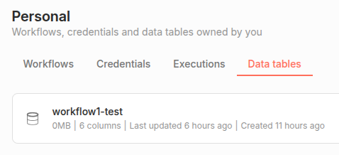

<!--

author: Volker G. Göhler

email:  volker.goehler@informatik.tu-freiberg.de

version: 0.0.1

language: de

narrator: Deutsch Male

edit: true
date: 2026
icon: img/TUBAF_Logo_EN_blau.png

logo: 
attribute: 

comment: Distributed Software

import: https://raw.githubusercontent.com/liaScript/mermaid_template/master/README.md

link: https://raw.githubusercontent.com/vgoehler/introduction-to-n8n/refs/heads/main/styles.css

title: Introduction to N8N Workflows 02

tags: Lehre, TUBAF

-->

# Einführung in n8n Workflows: Persistenz, Zustände & verlässliche Workflows

Volker Göhler, TU Bergakademie Freiberg

------------------------------

")<!-- style="width:500px;" -->

> "Code" auf https://github.com/vgoehler/introduction-to-n8n als Open Educational Ressource.

----------------------------------------

## Rückblick

** Was haben wir das letzte mal gelernt? **<!-- style="font-size:x-large;"-->

     {{1}}
> - Webhooks einrichten
> - Web APIs ansprechen
> - JSON Daten verarbeiten
> - credentials nutzen
> - Fehler behandeln
> - JSON Datenfluß verstehen

----------------------------------------

    {{2}}
> - Fortsetzen der Textverarbeitungsaufgabe

## Hands-on Aufgabe: Mehrstufige Textverarbeitung mit Web APIs

**Ziel der Aufgabe**<!-- style="font-size:x-large;"-->

Entwickeln Sie einen n8n-Workflow, der einen **Markdown-Text automatisiert verarbeitet**.

Der Workflow soll:

1. **Ein Markdown-Dokument aus CodiMD abrufen**
3. **Den Text mit DeepL ins Deutsche übersetzen**
4. **Für Wörter im Text alternative Begriffe (Synonyme) ermitteln**
5. **Ein strukturiertes Ergebnis zurückgeben**

---

** Rahmenbedingungen: **<!-- style="font-size:x-large;"-->

**Laden:**<!-- style="font-size:large;"-->

- HTTP Request Node für CodiMD, nutzen sie den download endpoint
`https://kanban.xsitepool.tu-freiberg.de/V906qTLQRj-pyzs7dOxctw/download`

**Übersetzen:**<!-- style="font-size:large;"-->

- DeepL Node mit Credentials

**Synonyme abrufen:**<!-- style="font-size:large;"-->

- müssen in Wörter gesplitet werden
- Code Node die Wörter im text splited `text.split(/[ \n]+/)` z.B.
- Split Out Node über die Liste um Listen in Einträge zu splitten
- Loop Node um über die Liste zu iterieren
- OpenThesaurus Node (funktioniert ohne Credentials) [API](https://www.openthesaurus.de/about/api)
    
    - Sicherstellen dass der Node auf Fehlerfälle eingestellt ist (z.B. kein Synonym gefunden)
    - Fallunterscheidungen treffen ob Synonyme gefunden wurden oder nicht
    - Bei gefundenen Synonymen können auch merhere Suchobjekte zurückgegeben werden. Geschickt ein Synonym auswählen (z.B. das erste).

- Aggregate Node um die Liste wieder zusammenzuführen
- in einer Code Node die Liste wieder in einen Text zusammenfügen z.B. `array.join(" ")`

**Weitere Nodes:**<!-- style="font-size:large;"-->

- Set, IF, Function Nodes nach Bedarf

**Hinweise zur Umsetzung:**<!-- style="font-size:large;"-->

- Synonyme müssen nicht für jedes Wort existieren
- Ein Wort hat (wahrscheinlich) mehrere Synonyme
- Variablen können per Drag and Drop gezogen werden!
- Falls Einträge aus dem Datastream von vorhergehenden Nodes gebraucht werden, nutzen Sie im Input das DropDownFeld um die entsprechende Node auszuwählen.
<!-- style="width:300px; margin-top:0px;" -->

- Fehlerfälle dürfen abgefangen werden, aber Funktionalität geht über Errorhandling
- nutzen Sie Sticky notes für Kommentare im Workflow
<!-- style="width:50px;" -->

### Reflexionsfragen

<section class="flex-container border">

- Wo entstehen Abhängigkeiten?
- Welche API ist der „Single Point of Failure“?
- Wie könnte man diesen Workflow testen?
- Welche Teile wären wiederverwendbar?

<!-- style="width:200px; margin-top:-50px;" -->

</section>

# n8n als System, nicht als Skript

**Lernziele dieser Sitzung**<!-- style="font-size:x-large;"-->

Nach dieser Einheit können Sie:

- erklären, warum Workflows Zustand brauchen
- Data Tables in n8n sinnvoll einsetzen
- mehrere Workflows zu einem System verbinden
- Fehler als Teil des Systems behandeln
- wiederverwendbare Subworkflows bauen

---

## Erinnerung: Unser letztes System

Wir hatten einen Workflow, der:

    {{1}}
- eine Datei aus dem Netz lädt
- den Inhalt übersetzt mittels API
- den Text in Wörter teilt
- für jedes Wort Synonyme sucht
- den Text wieder zusammensetzt

{{2}}

**Aber:**

- Jeder Lauf war isoliert.
- Nichts wurde „gemerkt“.

---

### Warum reicht das nicht?

In echten Systemen gibt es:

{{1}}
- Nutzer
- Identitäten
- Nachrichten
- Historie
- Fehlerprotokolle

{{1}}
<!--style="background-color:#ECFDF5;"-->
>
> ➡️ Systeme brauchen **Gedächtnis**.

---

### Gedankliches Modell: Daten vs. Zustand

| Datenfluss | Zustand |
|-----------|--------|
| JSON fließt | Daten bleiben |
| Flüchtig | Persistent |
| Input/Output | Systemzustand |
| Stateless | Stateful |

<!--style="background-color:#ECFDF5;"-->
>
> *n8n kann beides: aber nur, wenn wir es entwerfen.*

---

## Data Tables in n8n

Data Tables sind:

- strukturierte Tabellen
- persistent gespeichert
- zwischen Workflows teilbar

*Sie funktionieren wie:*

Eine kleine Datenbank in n8n.

<!--style="border: 1px grey solid; width: 500px; padding: 5px;"-->
<!-- style="width:500px;" -->

---

### Unsere Zieltabelle

Wir legen eine Data Table mit folgenden Spalten an:

- firstname
- surname
- birthday
- profession
- matrnr
- email

➡️ Das ist unser **zentrales Systemgedächtnis**.

---

### Warum Spalten & Typen wichtig sind

Falsche Typen führen zu:

- fehlerhaften Updates
- kaputten CSV-Dateien
- falschen Auswertungen

Beispiele:

- Geburtstag = Datum
- Matrikelnummer = Zahl
- Beruf = String (Dropdown)

---

## Hands-on: Systemarchitektur (konzeptionell)

<section class="flex-container">

Wir bauen keinen „Flow“, sondern:

➡️ Ein verteiltes Mini-System.

(Ein System von Workflows)

- **Dateneingabe** ➡️  Formular
- **Datenspeicherung** ➡️  Webhook
- **Datenhaltung** ➡️  Data Table
- **Reporting** ➡️  Scheduler
- **Fehlerbehandlung** ➡️  Error Workflow

<!-- style="min-width: 300px; width:400px; margin-top:20px;" -->

</section>

---

### Formular – Dateneingabe

Der erste Workflow:

- sammelt Daten
- erzwingt Typen
- bietet Auswahlfelder (Beruf)

Er ist:

<!--style="background-color:#ECFDF5; width:50%;"-->
> die Benutzeroberfläche unseres Systems.

---

**Wichtige Designpunkte im Formular**<!-- style="font-size:large;"-->

- Pflichtfelder
- Dropdown für profession
- Datentypen/Validierung (E-Mail, Nummern)

**Nodes:**<!-- style="font-size:large;"-->

- n8n Form Nodes
- Trigger Node
- Next Form Page Node
- Form Ending Node

---

### Webhook – die Systemschnittstelle

Dieser Workflow:

- empfängt JSON Daten des Formulars
- liest die Daten
- prüft die Werte (Set, IF, Code Nodes nach Bedarf)
- schreibt in Data Table (Data Table Nodes)

Er ist:

<!--style="background-color:#ECFDF5; width:50%;"-->
> der API-Layer unseres Systems.

---

**Warum ein eigener API-Workflow?**<!-- style="font-size:large;"-->

Nicht direkt vom Formular schreiben, sondern:

- von anderen Systemen nutzbar
- Validierung zentral
- leichter testbar
- ➡️ Entkopplung

---

**Upsert statt Insert**<!-- style="font-size:large;"-->

Der Workflow soll:

- neue Einträge anlegen
- bestehende (z. B. gleiche MatrNr) aktualisieren

---

### Hands-on Time: 🕕

<section class="flex-container">

Bevor wir zu weiteren Workflows kommen:

- Erstellen Sie die Data Table
- Bauen Sie den Formular-Workflow
- Bauen Sie den Webhook-Workflow

**Spalten**

- firstname
- surname
- birthday
- profession
- matrnr
- email

**Nodes**

- Data Table Nodes
- n8n Form Nodes
- Webhook und Http Request Nodes

<!-- style="min-width: 300px; width:400px; margin-top:-20px;" -->

</section>

---

### Der tägliche Batch Job

Ein Scheduler:

- läuft einmal pro Tag
- liest alle Einträge
- erzeugt eine CSV-Datei
- speichert sie

Das ist:

<!--style="background-color:#ECFDF5; width:50%;"-->
> - klassische Datenverarbeitung
> - Logging, Reporting, Backups etc.

---

### Datei-Erzeugung

**Nodes:**<!-- style="font-size:large;"-->

- Data Table Read
- Convert to File Node (CSV)
- Read/Write Files from Disk

Falls das fehlschlägt:

- Upload per FTP

*Test FTP Server:*

- https://dlptest.com/ftp-test/
- FTP URL: ftp.dlptest.com
- FTP User: dlpuser
- Password: rNrKYTX9g7z3RgJRmxWuGHbeu

---

**Warum ein Fallback?**<!-- style="font-size:large;"-->

- Probleme mit Netzwerk
- Probleme mit Berechtigungen

Fallback = System bleibt handlungsfähig.

---

### Publish & Error Workflows

Ein produktiver Workflow braucht:

- einen Error Trigger im Error Workflow
- einen Workflow, der den Error Workflow im Fehlerfall triggert
- dazu muss der Error Workflow veröffentlicht werden

<!-- style="width:600px;border: 1px solid grey;" -->

- Nur Fehlerlose Workflows können veröffentlicht werden.
- Zum setzen von Error Workflows in die Settings gehen. <!-- style="width:30px; border: 1px solid grey;" -->
- Dort den Error Workflow auswählen.
<!-- style="width:600px;border: 1px solid grey;" -->

Dieser:

- schreibt Logdatei
- oder sendet E-Mail
- oder speichert auf FTP
- ...

**Fehler sind:**

<!--style="background-color:#ECFDF5; width:50%; font-weight: bolder;"-->
>
> Teil des Systems, nicht das Ende davon.

---

### Hands-on Time: 🕒

<section class="flex-container">

- Erstellen Sie einen täglichen Batch Job
- Erstellen Sie einen Error Workflow

**Batch Job**

- soll alle Namen und Email aus der Data Table lesen
- in einer CSV Datei speichern
- diese auf dem FTP Server ablegen

**Error Workflow**

- soll Fehler des Batch Jobs loggen
- Ausgabe in Datei oder E-Mail, Chat etc.
- Error Trigger Node

<!-- style="min-width: 300px; width:400px; margin-top:0px;" -->

</section>

## Subworkflows

Gleiche Logik nicht kopieren, sondern:

- Datenvalidierung
- E-Mail-Versand
- Logging

auslagern als:

<!--style="background-color:#ECFDF5; width:50%;"-->
>
> wiederverwendbare Subworkflows.

Subworkflows 🔄 quasi Funktionen

Nicht einzelne Nodes, aber kurze Node-Gruppen.

---

### Contracts für Subworkflows

Jeder Subworkflow braucht:

- Execute Subworkflow + Trigger Node
- definierte Inputs
- run for all inputs vs. for single input
- wait for completion

Erstellen eines Subworkflows:

<!--style="background-color:#ECFDF5; width:50%;"-->
> - mehrere Nodes mit STRG + Klick auswählen, dann Rechtsklick → Create Subworkflow
> - Bei Änderung der Inputs des Subworkflows muss Published werden

---

## Warum das alles wichtig ist

Sie haben heute gebaut:

- ein Frontend
- eine API
- eine Datenbank
- einen Batch-Job
- ein System für Fehler

➡️ Das ist ein echtes Softwaresystem.

---

## Takeaways

- Workflows brauchen Zustand (manchmal)
- Data Tables = Systemgedächtnis
- APIs trennen Verantwortung
- Fehler gehören dazu
- Aber auch: erst das System dann Fehler handling
- Wiederverwendung spart Chaos

---

<!-- style="width:500px;" -->

> "Impression, soleil levant" von Claude Monet (1872) gilt als das Gemälde, das der Impressionismus-Bewegung ihren Namen gab.
