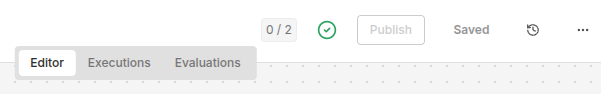
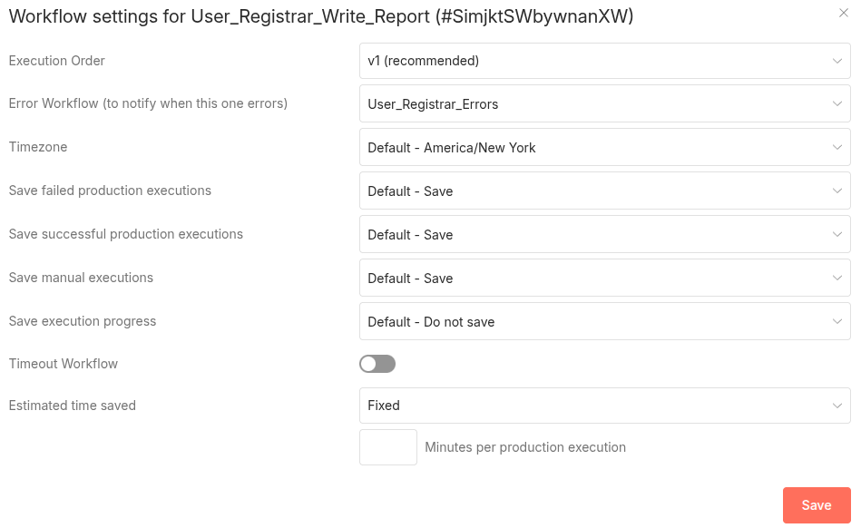

<!--

author: Volker G. Göhler

email:  volker.goehler@informatik.tu-freiberg.de

version: 0.0.2

language: de

narrator: Deutsch Male

edit: true
date: 2026
icon: img/TUBAF_Logo_EN_blau.png

logo: 
attribute: 

comment: Distributed Software

import: https://raw.githubusercontent.com/liaScript/mermaid_template/master/README.md

link: https://raw.githubusercontent.com/vgoehler/introduction-to-n8n/refs/heads/main/styles.css

title: Introduction to N8N Workflows 04

tags: Lehre, TUBAF

-->
[](https://liascript.github.io/course/?https://raw.githubusercontent.com/vgoehler/introduction-to-n8n/refs/heads/main/lesson_04.md)

# Einführung in n8n Workflows: REST Access & MCP

Volker Göhler, TU Bergakademie Freiberg

------------------------------

")<!-- style="width:500px;" -->

> "Code" auf https://github.com/vgoehler/introduction-to-n8n als Open Educational Ressource.

----------------------------------------

## Rückblick

**Nachtrag vom letzten mal**<!-- class="head" -->

Was haben wir letztes Mal gemacht?

    {{1}}
- Webhooks und Formulare genutzt
- Daten persistent gespeichert
- Workflows mit Zustand gebaut
- Systeme entworfen (nicht nur Abläufe)

### Formular – Dateneingabe

Der erste Workflow:

- sammelt Daten
- erzwingt Typen
- bietet Auswahlfelder (Beruf)
- n8n Form Nodes

---

### Webhook – die Systemschnittstelle

Dieser Workflow:

- empfängt JSON Daten des Formulars
- liest die Daten
- prüft die Werte (Set, IF, Code Nodes nach Bedarf)
- schreibt in Data Table (Data Table Nodes)

**Upsert statt Insert**<!-- style="font-size:large;"-->

Der Workflow soll:

- neue Einträge anlegen
- bestehende (z. B. gleiche MatrNr) aktualisieren

---

### Hands-on Time: 🕕

<section class="flex-container">
<div class="flex-child">
Bevor wir zu weiteren Workflows kommen:

- Erstellen Sie die Data Table
- Bauen Sie den Formular-Workflow
- Bauen Sie den Webhook-Workflow

<div class="colorbox colorbox--green" style="width:50%;">
<div class="colorbox__title">
**Spalten**
</div>

- firstname
- surname
- birthday
- profession
- matrnr
- email
</div>

<div class="colorbox colorbox--light-green" style="width:50%;">
<div class="colorbox__title">
**Nodes**
</div>

- Data Table Nodes
- n8n Form Nodes
- Webhook und Http Request Nodes
</div>

</div>
<div class="flex-child">
<!-- style="min-width: 300px; width:400px; margin-top:-20px;" -->
</div>
</section>

---

### Der tägliche Batch Job

Ein Scheduler:

- läuft einmal pro Tag
- liest alle Einträge
- erzeugt eine CSV-Datei
- speichert sie

Das ist:

<!--class="lia-callout lia-callout--note"-->
> - klassische Datenverarbeitung
> - Logging, Reporting, Backups etc.

---

### Datei-Erzeugung

**Nodes:**<!-- style="font-size:large;"-->

- Data Table Read
- Convert to File Node (CSV)
- Read/Write Files from Disk

Falls das fehlschlägt:

- Upload per FTP

<div class="colorbox colorbox--light-blue" >
<div class="colorbox__title">
*Test FTP Server:*
</div>
- https://dlptest.com/ftp-test/
- FTP URL: ftp.dlptest.com
- FTP User: dlpuser
- Password: rNrKYTX9g7z3RgJRmxWuGHbeu
</div>

---

**Warum ein Fallback?**<!-- style="font-size:large;"-->

- Probleme mit Netzwerk
- Probleme mit Berechtigungen

Fallback = System bleibt handlungsfähig.

---

### Publish & Error Workflows

Ein produktiver Workflow braucht:

- einen Error Trigger im Error Workflow
- einen Workflow, der den Error Workflow im Fehlerfall triggert
- dazu muss der Error Workflow veröffentlicht werden

<!-- style="width:600px;border: 1px solid grey;" -->

- Nur Fehlerlose Workflows können veröffentlicht werden.
- Zum setzen von Error Workflows in die Settings gehen. <!-- style="width:30px; border: 1px solid grey;" -->
- Dort den Error Workflow auswählen.
<!-- style="width:600px;border: 1px solid grey;" -->

Dieser:

- schreibt Logdatei
- oder sendet E-Mail
- oder speichert auf FTP
- ...

**Fehler sind:**

<!--class="lia-callout lia-callout--note"-->
>
> Teil des Systems, nicht das Ende davon.

---

### Hands-on Time: 🕒

<section class="flex-container">
<div class="flex-child">

- Erstellen Sie einen täglichen Batch Job
- Erstellen Sie einen Error Workflow

<div class="colorbox colorbox--green" style="width:50%;">
<div class="colorbox__title">
**Batch Job**
</div>
- soll alle Namen und Email aus der Data Table lesen
- in einer CSV Datei speichern
- diese auf dem FTP Server ablegen
</div>

<div class="colorbox colorbox--light-green" style="width:50%;">
<div class="colorbox__title">
**Error Workflow**
</div>
- soll Fehler des Batch Jobs loggen
- Ausgabe in Datei oder E-Mail, Chat etc.
- Error Trigger Node
</div>

</div>
<div class="flex-child">
<!-- style="min-width: 300px; width:400px; margin-top:0px;" -->
</div>
</section>

## Subworkflows

Gleiche Logik nicht kopieren, sondern:

- Datenvalidierung
- E-Mail-Versand
- Logging

auslagern als:

<!--class="lia-callout lia-callout--note"-->
>
> wiederverwendbare Subworkflows.

Subworkflows 🔄 quasi Funktionen

Nicht einzelne Nodes, aber kurze Node-Gruppen.

---

### Contracts für Subworkflows

Jeder Subworkflow braucht:

- Execute Subworkflow + Trigger Node
- definierte Inputs
- run for all inputs vs. for single input
- wait for completion


Erstellen eines Subworkflows:

<!--class="lia-callout lia-callout--note"-->
> - mehrere Nodes mit STRG + Klick auswählen, dann Rechtsklick → Create Subworkflow
> - Bei Änderung der Inputs des Subworkflows muss Published werden

---

## Takeaways

- Workflows brauchen Zustand (manchmal)
- Data Tables = Systemgedächtnis
- APIs trennen Verantwortung
- Fehler gehören dazu
- Aber auch: erst das System dann Fehler handling
- Wiederverwendung spart Chaos

-----

## REST APIs nutzen

---

**Lernziele dieser Sitzung**<!-- class="head" -->

Nach dieser Einheit können Sie:

- REST APIs gezielt nutzen
- API-Dokumentationen lesen und verstehen
- REST-Zugriffe als Workflows kapseln
- erklären, was MCP ist und wofür es gebraucht wird
- REST-Funktionalität für KI nutzbar machen

---

### Was ist REST?

[REST](https://en.wikipedia.org/wiki/REST) steht für:

- **Representational State Transfer**
- HTTP-basierte Kommunikation
- klar definierte Ressourcen
- zustandslose Interaktionen

Typisch:

- GET → lesen
- POST → erzeugen
- PUT/PATCH → ändern
- DELETE → löschen

---

### REST APIs lesen lernen

Eine REST API definiert:

- Endpunkte (URLs)
- Parameter
- Rückgabeformate
- Fehlerfälle

➡️ Fähigkeit:

> „Ich kann eine API ohne Beispielcode benutzen.“


---

## Hands-on Übung

<!-- class="head" -->
REST mit n8n nutzen

### REST API nutzen (Rick & Morty)

**Aufgabe: Charaktere einer Episode ermitteln**<!-- class="subhead" -->

Ziel:

- Nutzung der öffentlichen *Rick and Morty REST API*
- Informationen über Charaktere aus **einer bestimmten Episode**
- Fokus auf:

  - Parameter
  - Datenstruktur
  - Iteration

---

### Rick and Morty API – Überblick

<div class="colorbox colorbox--light-green" style="width:50%;">
<div class="colorbox__title">
Beispiel API:
</div>
[Rick and Morty API](https://rickandmortyapi.com/documentation)
</div>

Die API bietet:

- Episoden
- Charaktere
- Orte

➡️ Eine API mit Datenstrukturen, nicht flachen Daten.

---

**Datenfluss der Aufgabe**<!-- class="head" -->

1. Episode abrufen
2. Liste der Character-URLs extrahieren
3. Für jeden Charakter:

   - Charakterdaten abrufen

     - name
     - species
     - status

4. Ergebnisse zusammenführen

➡️ Klassischer REST-orchestrierter Workflow.

---

**REST-Aufruf (konzeptionell)**<!-- class="head" -->

```http
GET /api/episode/{id}
```

Antwort enthält:

- Name der Episode
- Liste von URLs zu Charakteren
- ...

---

** Herausforderung dieser Aufgabe**<!-- class="head" -->

- Mehrstufige REST-Aufrufe
- Listen von URLs
- Iteration notwendig
- Fehler möglich (404, leere Listen)

➡️ Reine REST-Nutzung reicht nicht – Orchestrierung ist nötig.

---

### REST APIs in n8n

In n8n benötigen wir:

- HTTP Request Node
- Datenextraktion
- Schleifen (z. B. Split in Batches)
- Zusammenführung der Ergebnisse

---

### Hands-on: n8n Workflow

<section class="flex-container">
<div class="flex-child">
Studierende bauen einen Workflow, der:

- eine Episode-ID entgegennimmt
- alle Charaktere dieser Episode abruft
- mit Name, Species und Status auflöst
- strukturierte Daten zurückgibt

Beispiel-Ausgabe:

```json
{
  "episode": "Pilot",
  "characters": [
    {
        "name": "Rick Sanchez",
        "species": "Human", 
        "status": "Alive" },
    { 
        "name": "Morty Smith", 
        "species": "Human", 
        "status": "Alive" }
  ]
}
```

</div>
<div class="flex-child">
<!-- style="min-width: 300px; width:400px; margin-top:20px;" -->
</div>
</section>

### Takeaways

- REST APIs sind die Grundlage moderner verteilter Systeme
- n8n eignet sich zur API-Orchestrierung
- API-Dokumentationen sind essenziell

---

## REST APIs für KI nutzbar machen

**Zwischenfrage: Was braucht eine KI dafür?**<!-- class="head" -->

Ein LLM kann:

- Text verstehen
- Entscheidungen treffen

Ein LLM kann **nicht**:

- selbst REST APIs aufrufen
- HTTP korrekt bauen
- Fehler sauber behandeln

➡️ Es braucht **Werkzeuge**.

---

### Was braucht ein LLM, um REST zu nutzen?

Notwendig sind:

- beschreibbare Funktionen
- klare Inputs
- klare Outputs
- stabile Schnittstellen

➡️ Genau hier kommt **MCP** ins Spiel.

---

### Was ist MCP?

MCP = **Model Context Protocol**

Es beschreibt:

- welche Tools existieren
- wie sie aufgerufen werden
- welche Daten sie erwarten
- was sie zurückgeben

➡️ MCP verbindet **KI** mit **Systemen**.

---

### Verbindung: n8n ↔ MCP

In unserem Setup:

- n8n-Workflows = Tools
- Webhooks = Tool-Endpunkte
- MCP beschreibt diese Tools

KI:
> entscheidet *wann* welches Tool benutzt wird.

---

### Diskussion: Was muss ein n8n-Workflow können?

Damit er MCP-tauglich ist:

- klarer Input
- klarer Output
- definierte Fehler
- keine UI-Abhängigkeit

➡️ Workflow als Service, nicht als Klickpfad.

---

### Aufgabe: MCP für den REST-Workflow

Studierende sollen:

- den REST-Workflow veröffentlichen
- Input definieren (Episode-ID)
- Output strukturieren
- Fehler modellieren
- MCP-Beschreibung entwerfen

---

### Warum MCP kein „Extra“ ist

MCP zwingt:

- saubere Architektur
- explizite Verträge
- klare Verantwortung

➡️ Es macht schlechte Workflows sichtbar.

---

### Reflexion

Diskussionsfragen:

- Was passiert bei falschen Parametern?
- Welche Fehler kann die KI nicht erkennen?
- Wo braucht es menschliche Kontrolle?

---

### Takeaways

- KI braucht Werkzeuge, keine Magie
- MCP verbindet KI mit realer Funktionalität

**KI ersetzt keine Systeme – sie steuert sie.**

---

<!-- style="width:500px;" -->

> "Impression, soleil levant" von Claude Monet (1872) gilt als das Gemälde, das der Impressionismus-Bewegung ihren Namen gab.
