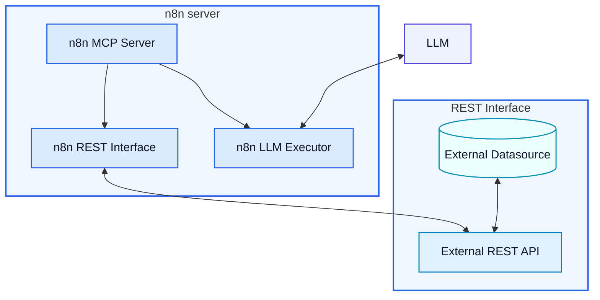

<!--

author: Volker G. Göhler

email:  volker.goehler@informatik.tu-freiberg.de

version: 0.0.1

language: de

narrator: Deutsch Male

edit: true
date: 2026
icon: img/TUBAF_Logo_EN_blau.png

logo: 
attribute: 

comment: Distributed Software

import: https://raw.githubusercontent.com/liaScript/mermaid_template/master/README.md

link: ./styles.css

title: N8N Workflows REST 06

tags: Lehre, TUBAF

-->
[](https://liascript.github.io/course/?https://raw.githubusercontent.com/vgoehler/introduction-to-n8n/refs/heads/main/lesson_06.md)

# n8n Workflows: Blockaufgabe -- Von REST APIs zu MCP und LLM Integration

Volker Göhler, TU Bergakademie Freiberg

------------------------------

")<!-- style="width:500px;" -->

> "Code" auf https://github.com/vgoehler/introduction-to-n8n als Open Educational Ressource.

----------------------------------------

## Rückblick

**Nachtrag vom letzten mal**<!-- class="head" -->

Was haben wir letztes Mal gemacht?

    {{1}}
- MCP Grundlagen
- n8n Workflows als MCP Tools
- Rick&Morty REST API und MCP kombinieren

## Blockaufgabe

<section class="flex-container">
<div class="colorbox colorbox--hints flex-child">
<div class="colorbox__title">
Schritte
</div>
- REST API aus Übung 8
- an n8n anschließen
- MCP dafür nutzen
- LLM Zugang für n8n
</div>
<div class="colorbox colorbox--but flex-child">
<div class="colorbox__title">
Flowchart
</div>

</div>
</section>

### 1. Paläo REST API

In Übung 8 haben Sie eine REST API geschrieben.

<div class="colorbox colorbox--hints" style="width:100%;">
<div class="colorbox__title">
Arbeitsanweisung
</div>
- holen Sie sich den Code von Übung 8
- starten Sie diese lokal (nutzen Sie z.B. `uvicorn`)
- testen Sie die API mit einem REST Client (z.B. Postman, Insomnia, n8n HTTP Request Node, curl, ...)
</div>

<!-- class="lia-callout--note" -->
> Lösungscode von Herrn Vater: [Übung 8 REST API](https://ificloud.xsitepool.tu-freiberg.de/index.php/s/ZtZo32PsDLdGioR)

```python main.py
#!/usr/bin/env python3

import uvicorn

def main():
    uvicorn.run(
            "fosil_rest_e08.server.8-1-Server:app",
            host="0.0.0.0",
            port=8008,
            reload=True,
            )
# Name ihrer App muss ggf. angepasst werden

if __name__ == "__main__":
    main()
```

### 2. Die REST API mit Daten füttern

<section class="flex-container">

<div class="colorbox colorbox--but flex-child">
<div class="colorbox__title">
🔌 Aufgabe: REST API im n8n-Workflow nutzen
</div>

- **Rufen Sie Daten** aus der digitalen paläontologischen Sammlung der TUBAF ab  
- **Verarbeiten und speichern Sie** die Ergebnisse in Ihrem n8n-Workflow  
- 🌐 **Datenquelle:**  
  [Digitale Paläontologische Sammlung der TUBAF](https://ifiweb.informatik.tu-freiberg.de/public/paleoweb/index.html)

- **API-Endpoint:**  
  `https://ifiweb.informatik.tu-freiberg.de/public/lehre/vs/api.php?action=fetch-model&model_id=<ID_NR>`

-  **Wichtig:**  
  `ID_NR` ist eine **positive Ganzzahl**, die **nicht kontinuierlich** vergeben ist
</div>
<div class="flex-child" style="width:100%;text-align:center;">
")<!-- style="margin-top: 6rem;" -->
</div>
</section>

<div class="colorbox colorbox--steps" style="width:100%;margin-top:1em;">
<div class="colorbox__title">
💡 Hinweise & Leitfragen
</div>

- ❓ **Fehlerbehandlung:**  
  Wie reagiert der Endpoint bei ungültigen oder nicht existierenden IDs?

- 💾 **Persistierung:** Was passiert wenn der REST-Server neu gestartet wird? Ansätze:

    {{1}}
   - **In n8n:**  
    Data Tables, Dateien oder Workflow-Zustand
   - **Serverseitig (Datenbank):**  
    Erweiterung des API-Servers um eine Datenbank  
    (z. B. SQLite oder eine verteilte Datenbank)
   - **Serverseitig (Serialisierung):**  
    Persistieren der In-Memory-Daten (z. B. als JSON)  
    und erneutes Laden beim Start des Servers

- 🔍 **Zustandsüberwachung:**  
  Wie erkennen Sie bereits gelesene Fossilien?  
  Gibt es Strategien für Updates oder erneute Abfragen?
</div>

### 3.1. LLM Integration in n8n

<div class="colorbox colorbox--batch" style="width:100%;margin-top:1em;">
<div class="colorbox__title">
Aufgabe: LLMs in n8n integrieren
</div>

- 🎯 **Ziel:** Binden Sie ein Large Language Model (LLM) in einen n8n-Workflow ein.
- **Integration in n8n:**  

  - native LLM-Nodes (z. B. OpenAI, Ollama)  
  - alternativ über den **HTTP Request Node** via REST API

- **Zwei grundlegende Betriebsmodelle:**

  - 🌐 **Cloud-basiert**
  - 🏠 **Lokal (Self-Hosting)**

</div>

#### 🌐 Cloud LLM mit API Key

Georg-August-Universität Göttingen: ([Chat-AI](https://www.uni-goettingen.de/de/686446.html))

<div class="colorbox colorbox--hints" style="width:100%;">
<div class="colorbox__title">
Zugriff auf Chat-AI der Universität Göttingen
</div>
- Ein **API-Key** wird bereitgestellt.
- Integration in n8n über den **OpenAI Node**:

  - Endpoint setzen auf `https://chat-ai.academiccloud.de/v1`
  - Modellnamen aus der [Chat-AI Modellübersicht](https://docs.hpc.gwdg.de/services/chat-ai/models/index.html)
  - **Wichtig:** Im Node das Dropdown auf *ID* stellen und Modell-ID manuell eintragen

- ⚠️ **Hinweis:**  
  Der API-Key ist **kontingentiert** (Anfragen pro Monat).  
  → Bitte bewusst und sparsam einsetzen.
</div>

<!-- class="subhead" -->
Beispielcode für die Nutzung der Chat-AI API mit Python:

```python connect_to_ChatAI.py
import os
from openai import OpenAI

API_KEY = os.environ.get("CHAT_AI_KEY")
API_URL = "https://chat-ai.academiccloud.de/v1"


client = OpenAI(
        api_key=API_KEY,
        base_url=API_URL
        )

response = client.responses.create(
        model="mistral-large-instruct",
        instructions="You are a professional teacher. Your answers should be didactic and detailed.",
        input="What is the capital of France?",
        )

print(response.output_text)
```

#### 🏠 Lokales Self-Hosting von LLMs

- Wir nutzen **Ollama** [https://ollama.com/](https://ollama.com/)
- Eine Open-Source Plattform zum **lokalen Verwalten und Ausführen** von LLMs
- Mittels eines CLI Tools werden Modelle lokal geladen und über eine REST-Schnittstelle bereitgestellt

<div class="colorbox colorbox--hints" style="width:100%">
<div class="colorbox__title">
🔧 **Grundlegende Schritte:**
</div>
- Installation von Ollama
- Modell laden oder starten

   - `ollama run mistral`  
   - `ollama pull llama3.3`

- LLM erreichbar unter: `http://localhost:11434`
- Integration in n8n über den **Ollama Node**
</div>

<!-- class="lia-callout--note" -->
> ⚠️ **Docker-Hinweis:**  \
Bei n8n im Docker-Container muss die **IP des Host-Rechners** verwendet werden.

<div class="colorbox colorbox--steps" style="width:100%;margin-top:1em;">
<div class="colorbox__title">
🔍 Hinweise & Abwägungen
</div>

- **Hardware-Anforderungen:**  
  GPU (VRAM), RAM und CPU prüfen
- **Empfehlung:**  
  Bei begrenzten Ressourcen kleinere, effiziente Modelle nutzen  
  (z. B. `Mistral-7B-v0.3`, `Llama3.2-3B`)
- **Abwägung:**  
  Cloud → einfach, leistungsfähig, eventuell teuer
  Lokal → kontrolliert, datenschutzfreundlich
</div>

Das lokal gehostete LLM kann direkt über die Ollama-REST-API angesprochen werden.

```python ollama_request.py
import requests
import json

OLLAMA_URL = "http://localhost:11434/api/generate"

payload = {
    "model": "mistral",
    "prompt": "Explain the concept of REST APIs in simple terms.",
    "stream": False
}

response = requests.post(
    OLLAMA_URL,
    headers={"Content-Type": "application/json"},
    data=json.dumps(payload)
)

response.raise_for_status()

result = response.json()
print(result["response"])
```

### 3.2. MCP Integration

<section class="flex-container">

<div class="colorbox colorbox--but flex-child" style="width:100%;">
<div class="colorbox__title">
🧩 Aufgabe: REST API als MCP-Tools in n8n integrieren
</div>

- 🎯 **Ziel:** Stellen Sie die Funktionen der REST API als **MCP-Tools** bereit, sodass ein LLM sie in n8n kontrolliert nutzen kann.
- **Denken Sie in Tools, nicht in Endpoints:** Ein Tool entspricht einer klaren Aktion (z. B. *"Fossilmodell abrufen"*), nicht einer generischen HTTP-Anfrage.
- Was benötigt das LLM an Informationen? Welche Tools sind sinnvoll?
- **Mindestanforderung:** Implementieren Sie mindestens **ein Tool** (lesend), das direkt auf den REST-Endpoint zugreift.
</div>

<div class="colorbox colorbox--errorwf flex-child" style="width:100%;">
<div class="colorbox__title">
🧭 Hinweise & Leitfragen (für Tool-Design)
</div>

- **Parameter-Design:**  
  Welche Parameter braucht das Tool? Datentypen? Validierungen?

- **Rückgabeformat:**  
  Was soll das Tool zurückgeben, damit das LLM sinnvoll weiterarbeiten kann? strukturierte JSON-Daten, Statusfelder, Fehlertypen

- **Fehlerbehandlung:**  
  Wie unterscheiden Sie **"nicht gefunden"** (404), **"ungültige Eingabe"** (400) und **"Serverfehler"** (5xx)? Welche Fehlermeldung ist für das LLM am hilfreichsten?

- ✅ **Testfälle (Kurzcheck):**

   - gültige ID **→** Erfolg
   - nicht existierende ID **→** definierter Fehler / leere Antwort
   - ungültige ID (z. B. Text) **→** validierter Parameterfehler
</div>

</section>

MCP nutzt das JSON-RPC 2.0 Format für die Kommunikation. Fehler sind dabei wie folgt zu melden:

```json
{
  "jsonrpc": "2.0",
  "id": "request-123",
  "error": {
    "code": -32601,
    "message": "Method not found",
    "data": "The method 'unknown_tool' does not exist"
  }
}
```
[Source](https://mcpcat.io/guides/error-handling-custom-mcp-servers/) \
Das Format nutzt eigene Fehlercodes, Sie können aber auf HTTP Fehlercodes aufbauen.


## Reflexion & Fazit

<section class="flex-container">

<div class="flex-child">

<div class="colorbox colorbox--hints" style="width:100%;">
<div class="colorbox__title">
🧭 Reflexion
</div>

- Wie verändert sich die Rolle von **Workflows**, wenn LLMs Entscheidungen treffen?
- Welche Verantwortung liegt beim **Systemdesign** – nicht beim Modell?
- Wo sind klare **Grenzen** zwischen Logik, Daten und KI sinnvoll?
</div>

<div class="colorbox colorbox--but" style="width:100%;margin-top:1em;">
<div class="colorbox__title">
✅ Fazit
</div>

- n8n ermöglicht die **strukturierte Orchestrierung** von APIs, Daten und LLMs
- es ermöglicht einfach automatisierte Workflows mit **geringerem Code-Aufwand**
- MCP schafft eine **klare Schnittstelle** zwischen LLMs und Funktionalität
- die Kombination eröffnet **neue Möglichkeiten** für intelligente Automatisierung

</div>

</div>

<div class="flex-child" style="width:100%;text-align:center;">

</div>

</section>
