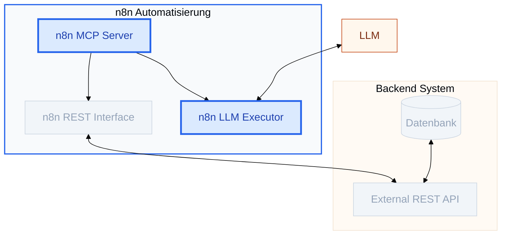

<!--

author: Volker G. Göhler

email:  volker.goehler@informatik.tu-freiberg.de

version: 0.0.1

language: de

narrator: Deutsch Male

edit: true
date: 2026
icon: img/TUBAF_Logo_EN_blau.png

logo: 
attribute: 

comment: Distributed Software

import: https://raw.githubusercontent.com/liaScript/mermaid_template/master/README.md

link: ./styles.css

title: N8N Workflows LLM + MCP + REST 07

tags: Lehre, TUBAF

-->
[](https://liascript.github.io/course/?https://raw.githubusercontent.com/vgoehler/introduction-to-n8n/refs/heads/main/lesson_06.md)

# n8n Workflows: Blockaufgabe -- Von REST APIs zu MCP und LLM Integration ♊

Volker Göhler, TU Bergakademie Freiberg

------------------------------

")<!-- style="width:500px;" -->

> "Code" auf https://github.com/vgoehler/introduction-to-n8n als Open Educational Ressource.

----------------------------------------

## Rückblick

**Nachtrag vom letzten mal**<!-- class="head" -->

Was haben wir letztes Mal gemacht?

    {{1}}
- Anfang der Blockaufgabe
- Pälaontologische REST API
- Datenbank Anbindung
- viel Spaß mit Docker und n8n 😒

## Blockaufgabe: System-Integration

<section class="flex-container">
<div class="colorbox colorbox--blue flex-child">
<div class="colorbox__title">
  🚀 Projekt-Status
</div>

- [x] **REST API** (aus Übung 8)
- [x] **n8n Integration**
- [ ] **MCP Implementierung** 
- [ ] **LLM Zugang einrichten**

> **Status:** Die Infrastruktur steht. Jetzt verknüpfen wir die API via MCP mit der Intelligenz des LLMs.

</div>

<div class="colorbox colorbox--light-blue flex-child">
<div class="colorbox__title">
  🏗️ Systemarchitektur
</div>


</div>
</section>

### Erledigte Aufgaben:

<div class="colorbox colorbox--light-blue" style="width:100%;">
<div class="colorbox__title">
1. Paläo REST API
</div>

- Endpunkte für Fossilmodelle
- Accessible über n8n HTTP Request Node

</div>

<div class="colorbox colorbox--blue" style="width:100%;">
<div class="colorbox__title">
2. Die REST API mit Daten füttern
</div>

- Persistenz der Daten
- Crawler für Fossilmodelle (`https://ifiweb.informatik.tu-freiberg.de/public/lehre/vs/api.php?action=fetch-model&model_id=<ID_NR>`)
- `ID_NR` von 1 bis 1000 (nicht alle existieren)
- Updates?

</div>

### 2.1. Wie finde ich meine REST Schnittstelle

In einer Docker-Umgebung bedeutet localhost immer „innerhalb dieses Containers“. Um von n8n (im Docker) auf Ihren Server (auf dem Host-Rechner) zuzugreifen, müssen wir die Netzwerk-Barriere überbrücken.

<!-- class="subhead" -->
**Option A:** Die IP-Adresse nutzen

Ermitteln Sie die IP-Adresse Ihres Host-Rechners im lokalen Netzwerk. Diese ist vom Container aus direkt erreichbar.

- **Befehl (Linux/Mac):** `ip -4 addr show | grep inet` oder `ifconfig`
- **Befehl (Windows):** `ipconfig`

In n8n: Nutzen Sie statt localhost direkt die IP.

<!-- class="subhead" -->
**Option B:** Host-Networking

Durch das Umstellen des Netzwerk-Modus auf host teilt sich der Docker-Container den Netzwerk-Stack mit Ihrem Betriebssystem. 127.0.0.1 verweist dann direkt auf Ihren Rechner.

**docker-compose.yaml anpassen: Fügen Sie network_mode: host hinzu.**

```yaml docker-compose.yaml
services:
  n8n:
    image: docker.n8n.io/n8nio/n8n
    container_name: n8n
    restart: unless-stopped
    network_mode: host  # <--- Wichtig: Container nutzt Host-Netzwerk
    volumes:
      - n8n_data:/home/node/.n8n
      - user_data:/user_data
    environment:
      - N8N_RUNNERS_ENABLED=true
      - N8N_RESTRICT_FILE_ACCESS_TO=/user_data

volumes:
  n8n_data:
  user_data:
```

<div class="colorbox colorbox--orange">
<div class="colorbox__title">
Besonderheit Windows (Docker Desktop):
</div>

Stellen Sie sicher, dass in den Docker Desktop Einstellungen unter Resources -> Network das Host-Networking aktiviert ist (bei neueren Versionen oft Standard).
</div>


> **Wichtig:** In n8n müssen Sie dann explizit die IP 127.0.0.1 verwenden. Der Name localhost wird innerhalb des n8n-Nodes oft nicht korrekt aufgelöst.

<div class="colorbox colorbox--blue">
<div class="colorbox__title">⚠️ Profi-Tipp für Mac/Windows</div>
Wenn Sie den <code>network_mode</code> nicht ändern möchten, können Sie unter Docker Desktop oft die spezielle Adresse <code>host.docker.internal</code> statt <code>localhost</code> verwenden, um den Host-Rechner zu erreichen.
</div>


### 3.1. LLM Integration in n8n

<div class="colorbox colorbox--green" style="width:100%;margin-top:1em;">
<div class="colorbox__title">
Aufgabe: LLMs in n8n integrieren
</div>

- 🎯 **Ziel:** Binden Sie ein Large Language Model (LLM) in einen n8n-Workflow ein.
- **Integration in n8n:**  

  - native LLM-Nodes (z. B. OpenAI, Ollama)  
  - alternativ über den **HTTP Request Node** via REST API

- **Zwei grundlegende Betriebsmodelle:**

  - 🌐 **Cloud-basiert**
  - 🏠 **Lokal (Self-Hosting)**

</div>

#### 🌐 Cloud LLM mit API Key

Georg-August-Universität Göttingen: ([Chat-AI](https://www.uni-goettingen.de/de/686446.html))

<div class="colorbox colorbox--blue" style="width:100%;">
<div class="colorbox__title">
Zugriff auf Chat-AI der Universität Göttingen
</div>
- Ein **API-Key** wird bereitgestellt.
- Integration in n8n über den **OpenAI Node**:

  - Endpoint setzen auf `https://chat-ai.academiccloud.de/v1`
  - Modellnamen aus der [Chat-AI Modellübersicht](https://docs.hpc.gwdg.de/services/chat-ai/models/index.html)
  - **Wichtig:** Im Node das Dropdown auf *ID* stellen und Modell-ID manuell eintragen

- ⚠️ **Hinweis:**  
  Der API-Key ist **kontingentiert** (Anfragen pro Monat).  
  → Bitte bewusst und sparsam einsetzen.
</div>

<!-- class="subhead" -->
Beispielcode für die Nutzung der Chat-AI API mit Python:

```python connect_to_ChatAI.py
import os
from openai import OpenAI

API_KEY = os.environ.get("CHAT_AI_KEY")
API_URL = "https://chat-ai.academiccloud.de/v1"


client = OpenAI(
        api_key=API_KEY,
        base_url=API_URL
        )

response = client.responses.create(
        model="mistral-large-instruct",
        instructions="You are a professional teacher. Your answers should be didactic and detailed.",
        input="What is the capital of France?",
        )

print(response.output_text)
```

#### 🏠 Lokales Self-Hosting von LLMs

- Wir nutzen **Ollama** [https://ollama.com/](https://ollama.com/)
- Eine Open-Source Plattform zum **lokalen Verwalten und Ausführen** von LLMs
- Mittels eines CLI Tools werden Modelle lokal geladen und über eine REST-Schnittstelle bereitgestellt

<div class="colorbox colorbox--blue" style="width:100%">
<div class="colorbox__title">
🔧 **Grundlegende Schritte:**
</div>
- Installation von Ollama
- Modell laden oder starten

   - `ollama run mistral`  
   - `ollama pull llama3.3`

- LLM erreichbar unter: `http://localhost:11434`
- Integration in n8n über den **Ollama Node**
</div>

<!-- class="lia-callout--note" -->
> ⚠️ **Docker-Hinweis:**  \
Bei n8n im Docker-Container muss die **IP des Host-Rechners** verwendet werden.

<div class="colorbox colorbox--orange" style="width:100%;margin-top:1em;">
<div class="colorbox__title">
🔍 Hinweise & Abwägungen
</div>

- **Hardware-Anforderungen:**  
  GPU (VRAM), RAM und CPU prüfen
- **Empfehlung:**  
  Bei begrenzten Ressourcen kleinere, effiziente Modelle nutzen  
  (z. B. `Mistral-7B-v0.3`, `Llama3.2-3B`)
- **Abwägung:**  
  Cloud → einfach, leistungsfähig, eventuell teuer
  Lokal → kontrolliert, datenschutzfreundlich
</div>

Das lokal gehostete LLM kann direkt über die Ollama-REST-API angesprochen werden.

```python ollama_request.py
import requests
import json

OLLAMA_URL = "http://localhost:11434/api/generate"

payload = {
    "model": "mistral",
    "prompt": "Explain the concept of REST APIs in simple terms.",
    "stream": False
}

response = requests.post(
    OLLAMA_URL,
    headers={"Content-Type": "application/json"},
    data=json.dumps(payload)
)

response.raise_for_status()

result = response.json()
print(result["response"])
```

### 3.2. MCP Integration: Von der API zum Tool

<div class="colorbox colorbox--blue" style="width:100%;">
<div class="colorbox__title">
🧩 Aufgabe: REST API als MCP-Tools bereitstellen
</div>

- 🎯 **Ziel:** Transformieren Sie Ihre REST-Endpunkte in **MCP-Tools**, damit das LLM in n8n aktiv mit Ihren Daten arbeiten kann.
- **Tool-Design vs. API-Design:** Ein Tool ist eine funktionale Einheit. Beschreiben Sie es so, dass ein "KI-Kollege" versteht, was es tut (z.B. statt `GET /fossil/:id` nutzen Sie das Tool `get_fossil_details`).
- **Anforderung:** Implementieren Sie mindestens **ein Lese-Tool**, das Daten live aus Ihrer API abfragt.
</div>

<div class="colorbox colorbox--light-orange" style="width:100%;">
<div class="colorbox__title">
🧭 Design-Leitfaden für robuste Tools
</div>

- **Semantische Parameter:** Nutzen Sie sprechende Namen und klare Typen. Das LLM muss wissen, ob es eine `fossil_id` (String) oder eine `anzahl` (Integer) senden soll.
- **Rückgabe-Struktur:** Das LLM "liest" die Antwort. Strukturieren Sie JSON so, dass das Wesentliche oben steht.
- **Fehler-Mapping:** Wenn Ihre API einen `404` wirft, übersetzen Sie dies für MCP in eine hilfreiche Nachricht ("Fossil mit ID 123 nicht in Datenbank gefunden").
</div>

#### Fehlerbehandlung & JSON-RPC 2.0

Da MCP auf **JSON-RPC 2.0** basiert, müssen technische Fehler (wie Verbindungsabbrüche oder ungültige Parameter) in einem spezifischen Format gemeldet werden. Dies erlaubt n8n und dem LLM, den Fehler korrekt einzuordnen.


```json JSON RPC Beispiel
{
  "jsonrpc": "2.0",
  "id": "req-001",
  "error": {
    "code": -32602,
    "message": "Ungültige Parameter",
    "data": "Das Feld 'year' muss eine Zahl zwischen 1900 und 2026 sein."
  }
}
```

-> [JSON RPC](https://mcpcat.io/guides/error-handling-custom-mcp-servers/) \
-> [error codes (python module)](https://pypi.org/project/mcp-error-codes/)

<div class="colorbox colorbox--light-orange" style="width:100%;"> <div class="colorbox__title">Standard-Fehlercodes (Auszug)</div>

<!-- data-type="none" -->
|Code|HTTP| Bezeichnung|Anwendung im MCP-Kontext|
|---|---|---|---|
|-32002|404|Not Found|Angeforderte Ressource (z. B. Fossilmodell) existiert nicht.|
|-32003|429|Rate Limit Exceeded|Zu viele Anfragen in kurzer Zeit.|
|-32007|408|Timeout|Die API hat zu lange gebraucht, um zu antworten.|
|-32601|400|Method Not Found|Tool-Name falsch geschrieben oder nicht registriert.|
|-32602|400|Invalid Params|LLM hat falsche Datentypen oder fehlende Felder gesendet.|
|-32603|500|Internal Error|Unerwarteter Fehler im Tool (z. B. Datenbankfehler).|
|-32603|500|Execution Error|Fehler während der Ausführung des Tools (z. B. Logikfehler).|

</div>

## Reflexion & Fazit

<section class="flex-container">

<div class="flex-child colorbox colorbox--blue" style="width:100%;">
<div class="colorbox__title">
🧭 Reflexion
</div>

- Wie verändert sich die Rolle von **Workflows**, wenn LLMs Entscheidungen treffen?
- Welche Verantwortung liegt beim **Systemdesign** und nicht beim Modell?
- Wo sind klare **Grenzen** zwischen Logik, Daten und KI sinnvoll?
- Wie können wir die **Limitierungen** von LLMs durch intelligentes Workflow-Design umgehen?
</div>

<div class="flex-child" style="width:100%;text-align:center;">

</div>

</section>

<div class="colorbox colorbox--light-blue" style="width:100%;margin-top:1em;">
<div class="colorbox__title">
✅ Fazit
</div>

- n8n ermöglicht die **strukturierte Orchestrierung** von APIs, Daten und LLMs
- es ermöglicht einfach automatisierte Workflows mit **geringerem Code-Aufwand**
- MCP schafft eine **klare Schnittstelle** zwischen LLMs und Funktionalität
- die Kombination eröffnet **neue Möglichkeiten** für intelligente Automatisierung

</div>

